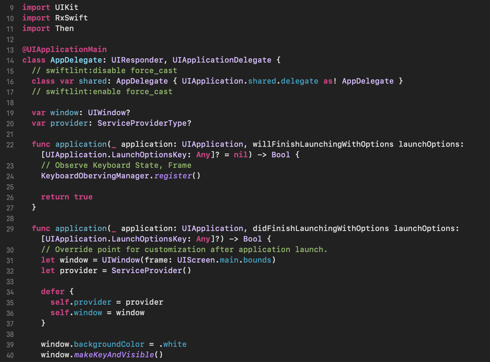

# Dark-XCode-Theme
make code easy to read & let your eyes comfort

# Screen Shots

# How To Install
[Theme Link](https://gist.githubusercontent.com/wotjd/b2387acccac0bc0fe85f5819b4adccfd/raw/cc481d3d2574d938225a9c5703274cbcf5574d9d/Dark-Readability.xccolortheme)
1. Donwload file: right click Theme Link & select `Save Link As...`
2. locate file to `~/Library/Developer/Xcode/UserData/FontAndColorThemes/`
3. Restart XCode
4. `command ,` or `XCode -> Preferences`, select `Dark-Readability` on `Fonts & Colors` tab
5. Done!
